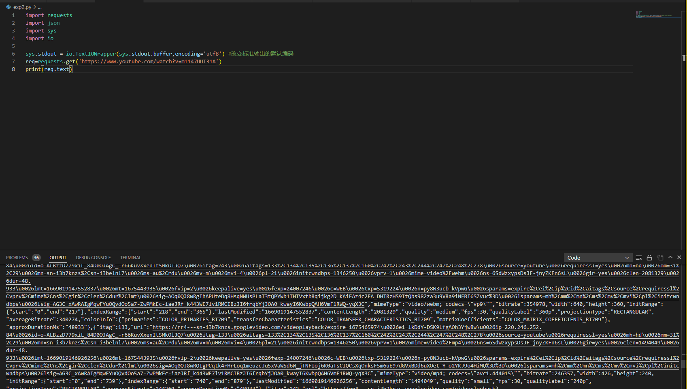

不论Google还是bing搜索，how to download YouTube video by python，矛头都指向了pytube，虽然同类下还有you-get，但是还是先看pytube

可以直接看到Pytube的YouTube类，对于title view等都很好爬取，bs4一下就爬出来了，主要还是看pytube里面的streams是怎么处理，同时判别怎么让这个部分加速。

那么我们直接源码搜索Stream，看看怎么获取的

看到了以下代码

```python
    @property
    def streaming_data(self):
        """Return streamingData from video info."""
        if 'streamingData' in self.vid_info:
            return self.vid_info['streamingData']
        else:
            self.bypass_age_gate()
            return self.vid_info['streamingData']
```

同时我们注意到那时候看title的时候也出现了这个vid_info

```python
    @property
    def title(self) -> str:
        """Get the video title.

        :rtype: str
        """
        if self._title:
            return self._title

        try:
            self._title = self.vid_info['videoDetails']['title']
        except KeyError:
            # Check_availability will raise the correct exception in most cases
            #  if it doesn't, ask for a report.
            self.check_availability()
            raise exceptions.PytubeError(
                (
                    f'Exception while accessing title of {self.watch_url}. '
                    'Please file a bug report at https://github.com/pytube/pytube'
                )
            )

        return self._title
```

所以我们直接看源码中的vid_info是怎么实现的，不难发现他的信息来源主要靠一个Innertube，以及他的一个方法.player

```python
    @property
    def vid_info(self):
        """Parse the raw vid info and return the parsed result.

        :rtype: Dict[Any, Any]
        """
        if self._vid_info:
            return self._vid_info

        innertube = InnerTube(use_oauth=self.use_oauth, allow_cache=self.allow_oauth_cache)

        innertube_response = innertube.player(self.video_id)
        self._vid_info = innertube_response
        return self._vid_info
```

我们知道pytube是一个YouTube视频下载器，那么这个Innertube是个啥东西，我们去Google一下。

官方文档是这样介绍Innertube的

Python Client for Google's Private InnerTube API. Works with: **YouTube**, **YouTube Music**, **YouTube Kids**, **YouTube Studio**

所以这个Innertube是一个Google Private的一个API库，那只能看源码来解析了（这里其实解析了大半了发现，内容和下文差不多）

然后就去看了you-get的库，关注到you-get有一个功能可以带-u参数直接拿到download url，那么直接去看you-get源码也许来的更方便一些

可以直接在src/you_get/extractors/youtube.py找到源码，经过源码审计不难发现，主要的逻辑在prepare里面

```python
    def prepare(self, **kwargs):
        assert self.url or self.vid

        if not self.vid and self.url:
            self.vid = self.__class__.get_vid_from_url(self.url)

            if self.vid is None:
                self.download_playlist_by_url(self.url, **kwargs)
                exit(0)

        if re.search('\Wlist=', self.url) and not kwargs.get('playlist'):
            log.w('This video is from a playlist. (use --playlist to download all videos in the playlist.)')

        # Get video info
        # 'eurl' is a magic parameter that can bypass age restriction
        # full form: 'eurl=https%3A%2F%2Fyoutube.googleapis.com%2Fv%2F{VIDEO_ID}'
        #video_info = parse.parse_qs(get_content('https://www.youtube.com/get_video_info?video_id={}&eurl=https%3A%2F%2Fy'.format(self.vid)))
        #logging.debug('STATUS: %s' % video_info['status'][0])
        video_info = {'status': ['ok'], 'use_cipher_signature': 'True'}

        ytplayer_config = None
        if 'status' not in video_info:
            log.wtf('[Failed] Unknown status.', exit_code=None)
            raise
        elif video_info['status'] == ['ok']:
            if 'use_cipher_signature' not in video_info or video_info['use_cipher_signature'] == ['False']: #签名
                self.title = parse.unquote_plus(json.loads(video_info["player_response"][0])["videoDetails"]["title"])
                # Parse video page (for DASH)
                video_page = get_content('https://www.youtube.com/watch?v=%s' % self.vid)
                try:
                    try:
                        # Complete ytplayer_config
                        ytplayer_config = json.loads(re.search('ytplayer.config\s*=\s*([^\n]+?});', video_page).group(1))
                        # Workaround: get_video_info returns bad s. Why?
                        if 'url_encoded_fmt_stream_map' not in ytplayer_config['args']:
                            stream_list = json.loads(ytplayer_config['args']['player_response'])['streamingData']['formats']
                        else:
                            stream_list = ytplayer_config['args']['url_encoded_fmt_stream_map'].split(',')
                        #stream_list = ytplayer_config['args']['adaptive_fmts'].split(',')
                        ........
```


不难发现他只用了get_content这个函数就获得了一个video_page，并对video_page进行正则划分就得到了信息的config

那么就去看get_content里面干了什么

```python
def get_content(url, headers={}, decoded=True):
    """Gets the content of a URL via sending a HTTP GET request.

    Args:
        url: A URL.
        headers: Request headers used by the client.
        decoded: Whether decode the response body using UTF-8 or the charset specified in Content-Type.

    Returns:
        The content as a string.
    """

    logging.debug('get_content: %s' % url)

    req = request.Request(url, headers=headers)
    if cookies:
        # NOTE: Do not use cookies.add_cookie_header(req)
        # #HttpOnly_ cookies were not supported by CookieJar and MozillaCookieJar properly until python 3.10
        # See also:
        # - https://github.com/python/cpython/pull/17471
        # - https://bugs.python.org/issue2190
        # Here we add cookies to the request headers manually
        cookie_strings = []
        for cookie in list(cookies):
            cookie_strings.append(cookie.name + '=' + cookie.value)
        cookie_headers = {'Cookie': '; '.join(cookie_strings)}
        req.headers.update(cookie_headers)

    response = urlopen_with_retry(req)
    data = response.read()

    # Handle HTTP compression for gzip and deflate (zlib)
    content_encoding = response.getheader('Content-Encoding')
    if content_encoding == 'gzip':
        data = ungzip(data)
    elif content_encoding == 'deflate':
        data = undeflate(data)

    # Decode the response body
    if decoded:
        charset = match1(
            response.getheader('Content-Type', ''), r'charset=([\w-]+)'
        )
        if charset is not None:
            data = data.decode(charset, 'ignore')
        else:
            data = data.decode('utf-8', 'ignore')

    return data
```

好像只是request了！然后在解码什么的操作。那么我们现在直接去get这个youtube网站，看看发生了什么



它里面也出现了我们需要的streams_list，也就是说其实streams_list是直接写在了GET网站的内容里面，那么只要解析一下，就完成了我们的目标.

然后稍微解析一下json就做完了，这里说一下这个方法的弊端，有的付费视频通过直接get的方式是拿不到信息的，这里没有做判别

目前任务：

看懂re（正则）是怎么筛选变成json的，然后组长来一下工，方便答辩，代码有看不懂可以直接qq我，后面几天人在上海有事，可能没时间回

https://www.youtube.com/watch?v=m1147UUT31A

这个是我的example

然后fps没有60的了，全是30，目前还没有解决办法，有解决办法的话，就是Innertube