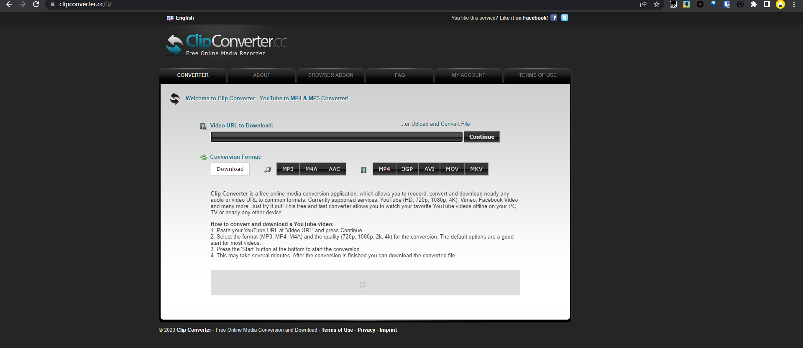
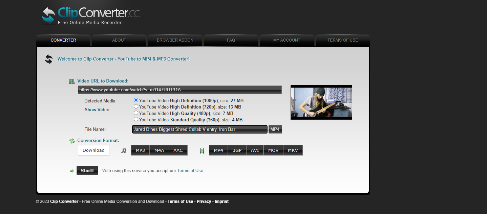
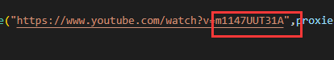
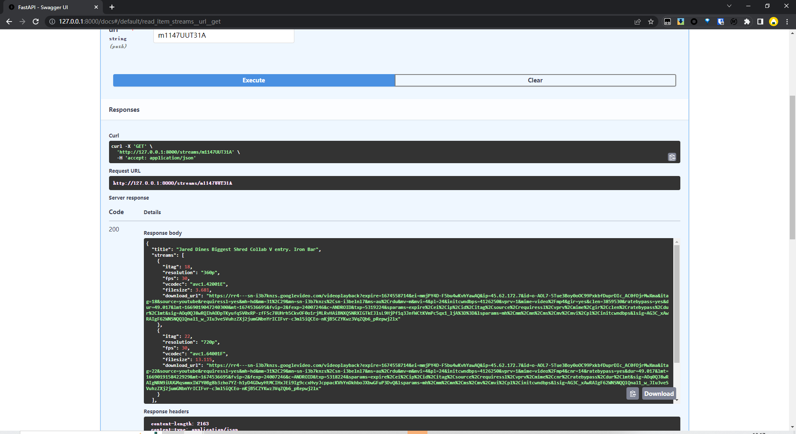

# Ztube

## 实现效果

类似于图片中的效果，即需要完成以下几个目标

1. 需要完成前端部分，vue或者自己熟悉的框架，前端可以做的简单一点

2. 后端就用fastapi+pytube（这部分也许不能用库的话，直接省源码，抄一部分有用的就可以了）

3. 前后端对接的话，其实这里没什么数据，前端也只是给几个连接，以及图片，如果要对接的话就用Apifox

## 前端

1.简洁一些，套个框架就可以了。

2.获取后端提供数据，返回，让用户点击下载就可以了。

   ## 后端

1.需要实现获取前端连接

2.解析，并返回相应列表给前端，以及视频图片

## 问题

后端编写的时候出现一些问题，后端其实已经写完了，已经能获取downloadurl了并且返回了

这里示范一下

直接打开main.py，运行就可以了，没有写--reload

然后可以直接去看api，127.0.0.1:8000/docs

然后可以试一下，那个url只要youtube网站后面的v后面的参数就可以了

然后就能返回所需要的一些参数

这里说明一下问题所在

就是目前流行的是渐进式推送，也就是说视频和音频合在一起的传播方式其实并不太行了，目前我是筛选了只要视频和音频合在一起的方式，但是题目要求要达到1080P，所以必须上渐进式，也就是音频和视频分开，那么做前后端分离就比较麻烦了，因为相当于后端要在电脑上合成完并上传网盘，这样就会十分麻烦，所以目前是打算前端不写vue，直接套pyqt了