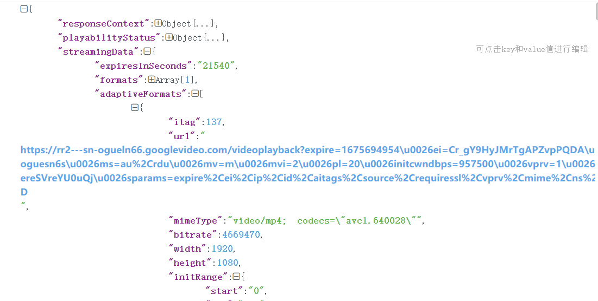

### 大致从网站上抓包并且从网站上的一些讲解中找到答案
首先是当我们打开网页后点击播放视频，会不断的捕获视频片段，这也就是渐进式流媒体的加载特征，不断地根据当前网络情况响应出不同清晰度视频碎片，
当点击任何一个包，找到请求的URL后进行访问并不会跳转到当前视频，但是在返回的respond中找寻链接的前半部分，发现在其中有很多匹配的链接，
点击这些链接后，发现可以完整的返回视频，
所以，视频URL就在这些链接中。解析其中的数据，找到返回内容所在部分，使用正则进行匹配
```python
import requests
import re
import json
from tqdm import tqdm
import os
headers = {
    'cookie': 'VISITOR_INFO1_LIVE=9qZVrzB27uI; PREF=f4=4000000&tz=Asia.Shanghai; _ga=GA1.2.621834420.1648121145; _gcl_au=1.1.1853038046.1648121145; NID=511=Zc1APdmEbCD-iqVNVgI_vD_0S3LVI3XSfl-wUZEvvMU2MLePFKsQCaKUlUtchHSg-kWEVMGOhWUbxpQMwHeIuLjhxaslwniMh1OsjVfmOeTfhpwcRYpMgqpZtNQ7qQApY21xEObCvIez6DCMbjRhRQ5P7siOD3X87QX0CFyUxmY; OTZ=6430350_24_24__24_; GPS=1; YSC=0E115KqM_-I; GOOGLE_ABUSE_EXEMPTION=ID=d02004902c3d0f4d:TM=1648620854:C=r:IP=47.57.243.77-:S=YmZXPW7dxbu83bDuauEpXpE; CONSISTENCY=AGDxDeNysJ2boEmzRP4v6cwgg4NsdN4-FYQKHCGhA0AeW1QjFIU1Ejq1j8l6lwAc6c-pYTJiSaQItZ1M6QeI1pQ3wictnWXTOZ6_y8EKlt0Y_JdakwW6srR39-NLuPgSgXrXwtS0XTUGXpdnt4k3JjQ',
    'referer': 'https://www.youtube.com/results?search_query=jk%E7%BE%8E%E5%A5%B3',
    'user-agent': 'Mozilla/5.0 (Windows NT 10.0; Win64; x64) AppleWebKit/537.36 (KHTML, like Gecko) Chrome/99.0.4844.84 Safari/537.36'
}
url = 'https://www.youtube.com/watch?v=m1147UUT31A'
response = requests.get(url=url, headers=headers)
html_data=response.text
json_str=re.findall('var ytInitialPlayerResponse = (.*?);var',html_data)[0]
```
返回的json数据就是我们需要的部分。然后对json数据进行解析。
这里找到一个格式化显示操作json数据的网站，方便我们找到所需要的数据

通过查找，发现其所在位置位于图片中所在位置，每一个adaptiveFormats都表示不同清晰度的视频或者音频链接，同时发现第一个视频为1080p的链接，倒数第二个为音频链接，那么，我们就可以暴力的获得内容了。但是，这个下载的过程过于漫长，如果是音频就会很快。具体代码在test中。